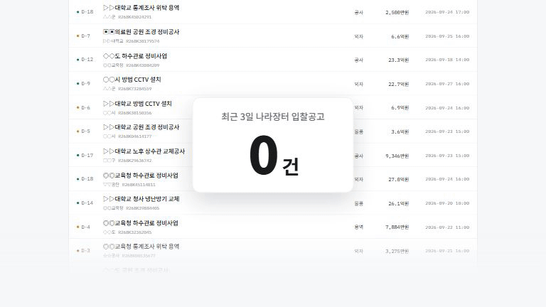

# 나라장터 입찰공고 알림봇

조달청 나라장터 입찰공고를 키워드로 걸러 보여주고, 새 공고가 뜨면 텔레그램으로 알려준다.
공고는 공공데이터포털 API 에서 실시간으로 가져온다.

화면은 [Claude Design 목업](https://claude.ai/design/p/2e8ce2a8-ea7b-4527-9f47-0cc406aca881)을 그대로 구현했다.



> 소개 영상은 [Remotion](https://www.remotion.dev) 으로 만들었다 (`video/`). 화면의 공고는 예시 데이터다.
> 다시 뽑으려면 `cd video && npm install && npm run render` (MP4) 후
> `npx remotion render Intro out/intro.gif --codec=gif --every-nth-frame=3 --scale=0.4` 로 GIF 를 만들어 `docs/` 에 복사한다.

- **발송**: 매일 저녁 9시(한국시간). Vercel Cron 이 `/api/notify` 를 부른다
- **중복 방지**: 보낸 공고번호를 기록해 같은 공고는 다시 보내지 않는다
- **빌드 없음**: 번들러도 프레임워크도 안 쓴다. 정적 파일 + 서버리스 함수

---

## 시작하기

### 1. 필요한 것

| 환경변수 | 어디서 받나 | 없으면 |
| --- | --- | --- |
| `G2B_SERVICE_KEY` | [공공데이터포털](https://www.data.go.kr)에서 "조달청_나라장터 입찰공고정보서비스" 활용신청 → 마이페이지의 **일반 인증키** | 검색이 안 된다 |
| `TELEGRAM_BOT_TOKEN` | 텔레그램 [@BotFather](https://t.me/BotFather) 에서 `/newbot` | 전송이 안 된다 |
| `TELEGRAM_CHAT_ID` | 봇에게 아무 말이나 건 뒤 `https://api.telegram.org/bot<토큰>/getUpdates` 의 `chat.id` | 전송이 안 된다 |
| `DATABASE_URL` | Neon 연결 문자열 (Vercel Marketplace 또는 [neon.tech](https://neon.tech)) | 로컬 파일에 저장된다 |
| `CRON_SECRET` | 아무 긴 임의 문자열. 배포본에만 설정한다 | `/api/notify` 가 누구에게나 열린다 |
| `ADMIN_PASSWORD` | 직접 정한 비밀번호. 배포본에만 설정한다 | 누구나 텔레그램 전송·규칙·즐겨찾기를 바꿀 수 있다 |

### 2. 로컬 실행

```bash
cp .env.example .env
```

`.env` 를 채우고:

```bash
npm install
npm run dev
```

http://localhost:4173 을 연다. Node 18 이상이면 된다.

`DATABASE_URL` 을 비워두면 `.data/` 폴더의 JSON 파일에 저장하므로, DB 없이도 전부 돌려볼 수 있다.

### 3. 배포

```bash
vercel link
vercel integration add neon    # Neon 을 새로 만들 때만
vercel env add G2B_SERVICE_KEY production
vercel env add TELEGRAM_BOT_TOKEN production
vercel env add TELEGRAM_CHAT_ID production
vercel env add CRON_SECRET production
vercel env add ADMIN_PASSWORD production
vercel deploy --prod
```

`CRON_SECRET` 과 `ADMIN_PASSWORD` 는 **production 에만** 넣는다. 로컬에 있으면 로컬에서도 막힌다.

---

## 구조

```
public/index.html  styles.css  app.js   브라우저에서 도는 화면 (Vercel 이 정적으로 서빙)
api/bids.js                             공고 검색
api/notify.js                           알림 배치 — 크론이 부르는 주소
api/send.js                             공고 한 건 즉시 전송
api/favorites.js                        즐겨찾기
api/alerts.js  api/rules.js             알림 이력, 알림 규칙
api/status.js                           환경변수 연결 상태 (값은 안 내보냄)
lib/g2b.js                              나라장터 API 클라이언트 + 응답 변환
lib/filter.js                           키워드 매칭 (검색과 배치가 같이 씀)
lib/telegram.js                         메시지 포맷 + 전송
lib/store.js                            저장소 고르기 — DATABASE_URL 있으면 Neon
lib/store-neon.js  lib/store-file.js    두 구현 (함수 모양이 같다)
lib/auth.js                             관리자 비밀번호 검사
lib/ratelimit.js                        IP별 요청 횟수 제한
lib/http.js  lib/env.js                 본문 읽기, .env 읽기
scripts/dev-server.mjs                  로컬 개발 서버 (배포에는 안 올라감)
scripts/migrate-to-neon.mjs             .data/ → Neon 이사
vercel.json                             크론 스케줄, 함수 타임아웃
```

> 프론트엔드가 `public/` 에 있는 이유: 루트에 `app.js` 나 `server.mjs` 가 있으면
> Vercel 이 그걸 서버 진입점으로 보고 브라우저 코드를 함수로 실행한다.
> (`ReferenceError: location is not defined` 로 500 이 났었다.)

**인증키는 서버에만 둔다.** 브라우저가 나라장터를 직접 부르면 키가 노출되므로, 조회는 항상 `api/` 를 거친다.

### 일은 어디서 나눠 하나

| | 하는 일 | 바꾸면 |
| --- | --- | --- |
| 서버 (`/api/bids`) | 업무유형별 공고 조회, 포함/제외 키워드 대조 | 나라장터를 다시 조회 |
| 브라우저 (`public/app.js`) | 검색어, 추정가격, 남은 날짜, 정렬 | 가져온 결과 안에서 즉시 반영 |

키워드는 서버에서 거른다. 3일치만 해도 5,000건이 넘어서 전부 브라우저로 내리면 느리기 때문이다.

---

## 화면

- **검색** — 필터 + 결과 목록 + 상세 (나라장터 원문으로 이동, 텔레그램 즉시 전송)
- **설정** — 확인 주기, 키워드 규칙, 연결 상태. 로컬에서는 "지금 한 번 실행" 으로 배치를 직접 돌릴 수 있다
- **알림 이력** — `alert_log` 에서 읽어온 실제 전송 기록
- **즐겨찾기** — ★ 로 담아둔 공고. 서버에 저장되므로 기기를 바꿔도 남는다
- **텔레그램** — 실제 검색 결과로 만든 메시지 미리보기, 포함 항목 토글

### 설정이 두 군데 저장되는 이유

"설정 저장" 은 브라우저(`localStorage`)와 서버(`settings` 테이블) 양쪽에 쓴다.
크론은 브라우저 저장소를 읽을 수 없어서, 자동 실행에 쓸 규칙은 서버에 있어야 한다.

필터·정렬처럼 기기마다 달라도 되는 값만 브라우저에 남는다.

---

## 알림 동작

`/api/notify` 가 한 회차에 하는 일:

1. 저장된 규칙(`settings`)으로 최근 N일 공고를 조회
2. 포함 키워드에 맞고 제외어에 안 걸린 것만 남김
3. **이미 보낸 공고는 건너뜀** — 열쇠는 `공고번호 + 차수`. 차수가 오르면(재공고) 새 공고로 본다
4. 남은 것을 **한 통에 5건씩, 한 회차에 최대 4통** 보냄
5. 전송에 성공한 건만 기록. 실패하면 다음 회차에 다시 시도한다

한도를 넘긴 건은 보내지도 기록하지도 않으므로 다음 회차에 그대로 잡힌다.

> 목업에는 "5건만 보내고 나머지는 외 n건" 으로 되어 있었는데,
> 그러면 내용을 못 본 공고가 전송됨으로 기록돼 영영 안 온다. 그래서 나눠 보내도록 바꿨다.

알림 시간대(`quietStart`~`quietEnd`)와 주말 설정 밖이면 보내지 않는다.

| 쿼리 | 뜻 |
| --- | --- |
| `?dry=1` | 보내지 않고 보낼 내용만 돌려준다 |
| `?force=1` | 알림 시간대·주말 규칙을 무시한다 |

---

## 스케줄

```json
{ "crons": [{ "path": "/api/notify", "schedule": "0 12 * * *" }] }
```

**크론은 UTC 로 돈다.** `0 12` 는 UTC 정오 = 한국시간 21:00.
시각을 바꾸려면 `vercel.json` 을 고치고 다시 배포해야 한다. 화면의 "확인 주기" 설정으로는 안 바뀐다.

Hobby 플랜의 크론은 하루 한 번까지고, 지정한 시각 근처에서 실행된다(분 단위로 정확하지 않다).

`/api/notify` 는 텔레그램을 보내고 공고 API 호출 한도를 쓰므로 `CRON_SECRET` 으로 막아뒀다.
Vercel 이 크론을 부를 때 `Authorization: Bearer $CRON_SECRET` 을 자동으로 붙인다.

시간대 판단은 `Asia/Seoul` 기준이다(`ALERT_TIMEZONE` 으로 바꿀 수 있다).
서버는 UTC 로 돌기 때문에 `Date#getHours()` 를 그냥 쓰면 9시간 어긋난다.

---

## 저장소

`DATABASE_URL` 이 있으면 Neon, 없으면 `.data/` 폴더의 JSON 파일을 쓴다.
두 구현은 함수 이름과 돌려주는 모양이 같아서, 부르는 쪽(`api/*`)은 어느 쪽이 쓰이는지 모른다.

| 하는 일 | 테이블 |
| --- | --- |
| 중복 방지 | `sent_notices` — 기본키는 공고번호 + 차수 |
| 알림 이력 | `alert_log` |
| 알림 규칙 | `settings` |
| 즐겨찾기 | `favorites` |
| 요청 횟수 제한 | `rate_limits` |
| 공고 API 사용량 | `api_usage` |

테이블은 첫 질의 때 자동으로 만들어진다. 마이그레이션 도구는 없다.

파일 저장소는 **로컬 전용**이다. Vercel 은 `/tmp` 말고는 쓰기가 안 되고 함수가 새로 뜨면 사라진다.
파일로 쓰다가 Neon 을 붙였다면 `node scripts/migrate-to-neon.mjs` 로 옮긴다.

즐겨찾기는 예전에 브라우저 `localStorage` 에 있었다. 화면을 처음 열 때 남아 있는 게 있으면
서버로 한 번 올리고 브라우저에서 지운다(`fetchFavorites`). 같은 공고는 id 로 걸러지므로 여러 번 열어도 안전하다.

---

## API 연동 메모

- 엔드포인트: `https://apis.data.go.kr/1230000/ad/BidPublicInfoService`
- 업무유형별로 오퍼레이션이 따로다 — 공사 `...Cnstwk`, 용역 `...Servc`, 물품 `...Thng`, 외자 `...Frgcpt`
- `inqryDiv=1` (등록일시 기준) + `inqryBgnDt`/`inqryEndDt` 를 `YYYYMMDDHHMM` 으로 준다
- **이 API 에는 키워드 검색 파라미터가 없다.** 기간 내 공고를 전부 받아서 직접 걸러야 한다
- 개발계정 일일 한도는 오퍼레이션당 1,000회

### 속도

한 번 호출에 999건 / 약 4.5MB / 4초쯤 걸린다. 3일치 4개 유형이면 5,000여 건이라 **처음 조회는 10~30초**.
그래서 두 가지를 넣었다.

- 페이지를 순서대로 돌지 않고, 1페이지로 전체 건수를 안 뒤 나머지를 한꺼번에 부른다
- 조회 결과를 10분간 캐시한다 (키: 업무유형 + 기간). 키워드만 바꾸면 다시 부르지 않는다

측정값: 처음 11.6초 → 이후 9밀리초.

### 응답 필드 매핑

| 화면 | API 필드 |
| --- | --- |
| 공고명 | `bidNtceNm` |
| 발주기관 / 수요기관 | `ntceInsttNm` / `dminsttNm` |
| 추정가격 | `presmptPrce` (없으면 `asignBdgtAmt` → `bdgtAmt`) |
| 마감일시 | `bidClseDt` |
| 원문 링크 | `bidNtceDtlUrl` |
| 공고종류 | `ntceKindNm` (등록·변경·취소·재공고) |

목록 응답에는 참가가능지역이 없어서, 지역은 공동계약 의무지역(`jntcontrctDutyRgnNm1~3`)만 보여준다.
정확한 참가가능지역이 필요하면 `getBidPblancListInfoPrtcptPsblRgn` 을 따로 불러야 한다.

---

## 누가 무엇을 할 수 있나

| 요청 | 막는 방법 |
| --- | --- |
| 검색 (`/api/bids`) | 누구나 — 단, IP당 10분에 30회 |
| 알림 이력·즐겨찾기·규칙 보기 | 누구나 |
| 텔레그램 즉시 전송 (`/api/send`) | `ADMIN_PASSWORD` |
| 규칙 저장 (`POST /api/rules`) | `ADMIN_PASSWORD` |
| 즐겨찾기 담기·빼기 (`POST`/`DELETE /api/favorites`) | `ADMIN_PASSWORD` |
| 알림 배치 (`/api/notify`) | `CRON_SECRET` — 크론만 |

화면에서 쓰는 동작을 처음 하면 비밀번호 창이 뜬다. 맞으면 그 브라우저가 기억하고, 설정 탭에서 지울 수 있다.
비밀번호는 `x-admin-password` 헤더로 가고, 서버는 해시끼리 비교한다(`lib/auth.js`).

> Vercel 의 Deployment Protection 을 쓰지 않은 이유: Hobby 플랜의 Standard Protection 은
> 배포마다 생기는 주소만 막고 실제 서비스 주소(`<프로젝트>.vercel.app`)는 열어둔다.
> 전체를 막는 옵션은 Pro 플랜부터다.

## 알아둘 점

- **사용자 구분이 없다.** 관리자 비밀번호는 하나뿐이고, 이 앱을 쓰는 사람이 하나라는 전제다. 여러 명이 쓰려면 로그인과 테이블별 사용자 열쇠가 필요하다.
- **요청 횟수 제한은 IP 기준이다.** IP를 바꿔가며 부르는 상대는 못 막는다. 그래서 공고 API 한도는 따로 지킨다(아래).
- **인증키를 커밋하지 말 것.** `.env`, `.env.*`(`.env.example` 제외), `.data/` 는 `.gitignore` 에 넣어뒀다.

## 공고 API 한도 지키기

개발계정은 업무유형(오퍼레이션)마다 하루 1,000회까지 부를 수 있다. 검색이 이걸 다 쓰면 저녁 9시 알림이 실패한다. 그래서 세 겹으로 막는다.

| 겹 | 어디서 | 하는 일 |
| --- | --- | --- |
| CDN 캐시 | `/api/bids` 응답의 `s-maxage=60` | 같은 주소는 60초 동안 함수까지 오지도 않는다 |
| IP별 제한 | `lib/ratelimit.js` | IP 하나가 10분에 30회. 넘으면 429 + `Retry-After` |
| 일일 예산 | `lib/g2b.js` | 검색은 업무유형마다 하루 **700회**까지만 새로 조회한다. 나머지 300회는 크론 몫 |

- 일일 예산은 **캐시에 없어서 실제로 나라장터를 불러야 할 때만** 확인한다. 실제 호출마다 `api_usage` 에 센다
- 크론(`/api/notify`)은 예산 제한을 받지 않는다. 한 번 도는 데 업무유형당 2~4회 쓴다
- 날짜는 한국 시간 기준으로 바뀐다
- 오늘 사용량은 설정 화면의 "연결 상태" 에서 볼 수 있다

### 사용량 경고

업무유형마다 호출 수가 아래 기준선을 밟으면 텔레그램으로 한 번 알리고, 알림 이력에 `경고` 로 남긴다.

| 호출 수 (기본값) | 단계 | 뜻 |
| --- | --- | --- |
| 560 | 주의 | 검색 예산의 80% |
| 700 | 경고 | 검색 예산 소진 — 검색은 더 이상 새로 조회하지 않는다 |
| 900 | 위험 | 하루 한도의 90% — 넘으면 저녁 알림이 실패한다 |

"보냈는지" 를 따로 기록하지 않는다. 카운터가 한 문장으로 1씩 오르므로 기준선 값을 정확히 받는 요청은 하루에 하나뿐이고, 그 요청만 알린다.
경고 전송에 실패해도 조회는 계속된다.

카운터 저장소(DB)가 실패하면 IP 제한은 **통과시킨다.** DB 장애 하나로 검색 전체가 막히는 것보다 잠깐 제한이 풀리는 편이 낫다고 봤다.

| 환경변수 | 기본값 |
| --- | --- |
| `BIDS_RATE_LIMIT` | 30 (10분당, IP 하나) |
| `SEARCH_DAILY_CALL_LIMIT` | 700 (하루, 업무유형 하나) |
| `G2B_DAILY_CALL_LIMIT` | 1000 (개발계정 한도. 운영계정으로 올리면 바꾼다) |

## 남은 것

- 참가가능지역을 `getBidPblancListInfoPrtcptPsblRgn` 으로 따로 가져오기
